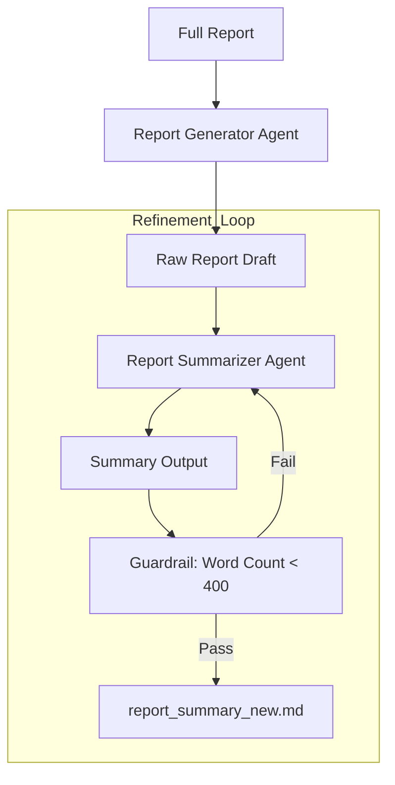

# HLD: Report Summarization Crew

This crew uses a **Sequential Process** with **Guardrails** to ensure summaries meet specific length requirements.

## 🏛️ Architecture Chart

## 🛠️ Components
- **Report Generator**: Drafts the initial full report.
- **Report Summarizer**: Compresses the report into a summary.
- **Guardrail**: A Python function that validates word count and triggers retries if necessary.
- **LLM**: Powered by NVIDIA NIM (Llama-3.1-70B).
