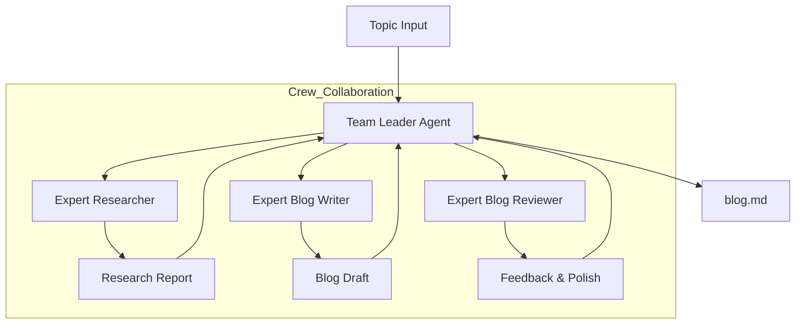

# HLD: Blog Generation Crew

This crew uses a **Hierarchical Process** to research, write, and review blog content.

## 🏛️ Architecture Chart

## 🛠️ Components
- **Manager (Team Leader)**: Orchestrates the workflow and delegates tasks.
- **Researcher**: Uses `SerperDevTool` for web research.
- **Writer**: Focuses on engaging tone and analogies.
- **Reviewer**: Ensures quality and simplicity.
- **LLM**: Powered by NVIDIA NIM (Llama-3.1-70B).
