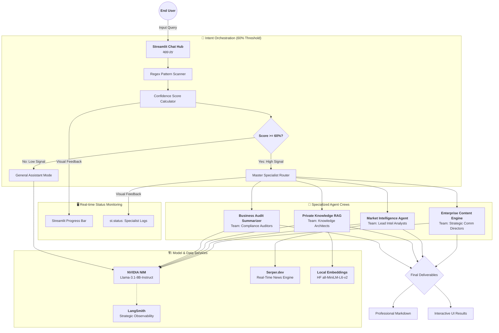

# 🏛️ OmniCrew Master Architecture (HLD)

This High-Level Design document outlines the complete architectural orchestration of the **OmniCrew Orchestration Suite**, featuring a **High-Confidence Intent Routing Layer**.

## 📊 Detailed System Orchestration Chart

## 🧩 Architectural Deep-Dive

### 1. High-Confidence Cognitive Routing
The core innovation of OmniCrew is the **60% Confidence Gate**. Unlike traditional systems that guess user intent, OmniCrew uses a multi-pattern Regex scanner. A specialized "Specialist Crew" is only activated if **2 or more** high-signal keywords are detected (Total Score >= 60%).

### 2. Live Orchestration Monitoring (UI)
The architecture includes a real-time feedback loop. Users see exactly what the system is "thinking":
- **Confidence Meter**: Shows the mathematical certainty of the intent detection.
- **Workflow Status**: Expands to show live logs of which specialist is active and which tool (Search, Vector DB) is being called.

### 3. Model & Data Hybridization
- **LLM**: Centralized reasoning via **NVIDIA NIM** for high-speed inference.
- **RAG**: Local document processing via **HuggingFace** to ensure 100% data privacy and 0% OpenAI API dependence.

---
*Architected for Enterprise Stability, Security, and Scalable Performance.*
