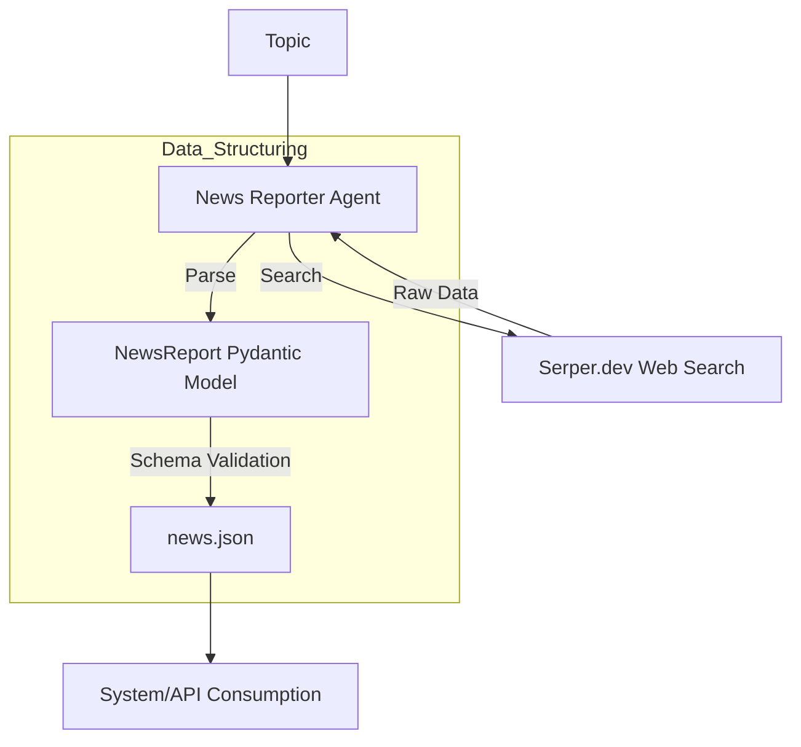

# HLD: News Report Crew

This crew specializes in gathering web news and outputting data in a **Structured JSON** format.

## 🏛️ Architecture Chart

## 🛠️ Components
- **News Reporter Agent**: Uses `SerperDevTool` for real-time news.
- **Pydantic Model**: Defines the structure (Headline, URL, Summary, Agency).
- **LLM**: Powered by NVIDIA NIM (Llama-3.1-70B).
