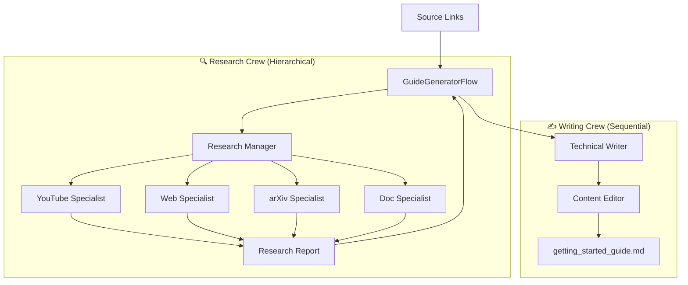

# HLD: Guide Generator Flow

This is a **Multi-Crew Orchestration** system that connects a research team and a writing team.

## 🏛️ Architecture Chart

## 🛠️ Components
- **Research Crew**: A hierarchical unit focused on data gathering.
- **Writing Crew**: A sequential unit focused on content polish.
- **Shared State**: Passes the research report from the first crew to the second.
- **LLM**: Powered by NVIDIA NIM (Llama-3.1-70B).
