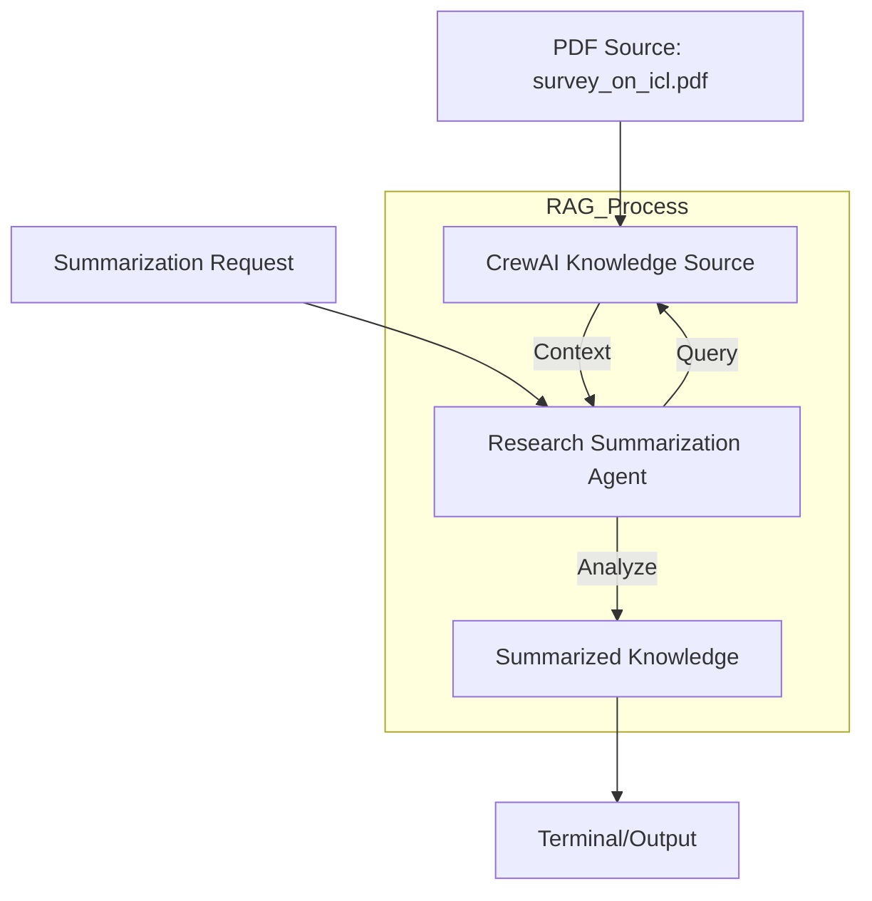

# HLD: Knowledge Crew

This crew demonstrates **Retrieval Augmented Generation (RAG)** by integrating local PDF documents into the agent's knowledge base.

## 🏛️ Architecture Chart

## 🛠️ Components
- **PDFKnowledgeSource**: Handles chunking and embedding of the PDF.
- **Research Summarization Agent**: Specialized in analyzing long technical documents.
- **LLM**: Powered by NVIDIA NIM (Llama-3.1-70B).
