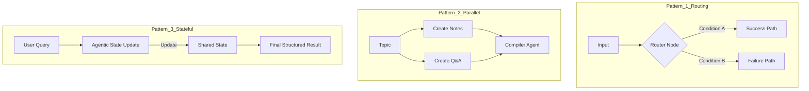

# HLD: CrewAI Flows Architecture

This module demonstrates advanced **Event-Driven Orchestration** using the CrewAI Flow API.

## 🏛️ Architecture Chart (Flow Patterns)

## 🛠️ Components

- **Flow API**: Manages state, triggers, and listeners.
- **Structured State**: Uses Pydantic for type-safe data sharing across nodes.
- **Orchestrator Agents**: Small, focused agents embedded within Flow nodes.
